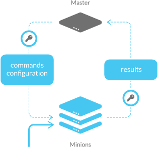

SaltStack
=====

[SaltStack](www.saltstack.com) is a master/slave provision system in python, it is using zeromq for asynchonous communication. 

# Architecture 

Master and minion 

# References

- https://www.linux.com/learn/tutorials/772719-how-to-provision-aws-ec2-instances-with-salt-cloud